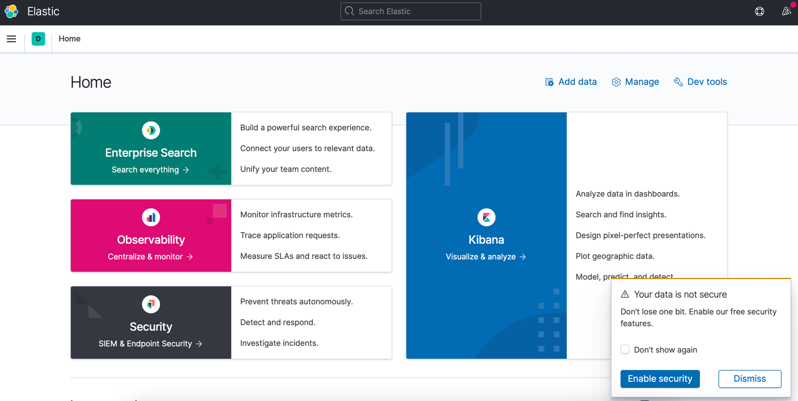
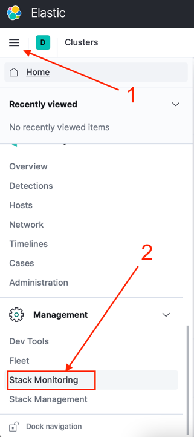
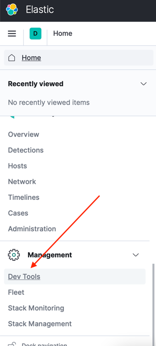
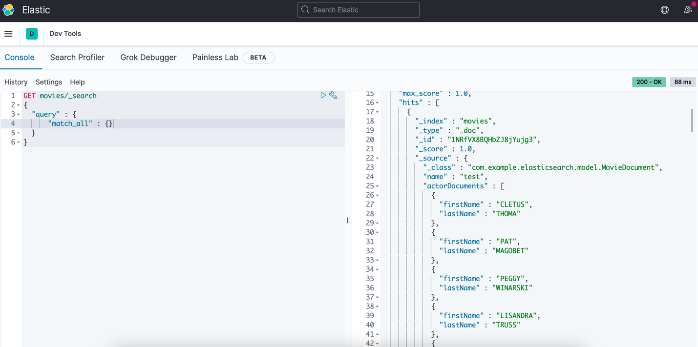

# Elasticsearch Spring App
## _Made with Spring Framework by Denizhan Aras_

This spring app is a basic RESTful Web Service to create and delete movies.
Elasticsearch was used in this project as our search engine.

- Made with Spring Framework.
- Back-end serves at localhost:8080
- MySQL serves at localhost:3308
- Elasticsearch serves at localhost:9200
- Kibana serves at localhost:5601
- Docker, Elasticsearch, Kibana and Spring Data Elasticsearch were used.
- Check below for details.

## 1) Set up environment
- To set up environment, please go to ***app-setup*** directory from a terminal.
- Run docker compose command. (Described below.)
- ***If compose fails please give Docker at least 4 GB memory from Settings.***
```
cd app-setup
```
```
docker-compose up
```
- If there is no error your spring application ready to run.

## 2) Test application
- To test application, I recommend you POSTMAN.
- You can find exported request set as a json package inside app-setup folder.
- Import this json package to the POSTMAN.
- If there is no error you can ready to test your spring application.

## 3) Check Kibana for indexed Data
- After trying to add a movie, you can check Kibana to see your data.
- To reach kibana open a web browser, go to:
```
localhost:5601
```
- Kibana screen should appear like below:

 
 
- If Kibana page not loading check container status from Docker.
- If it says "kibana is not ready yet.", refresh the page until it is ready.


- From this page you can navigate to Clusters page with two steps.
- Please open the side menu and follow these steps:



- From this page, you can see Docker Cluster is here.
- If it is now showing, setup cluster with default settings by following steps said by Kibana.
- If there is no problem, we can now view our data.
- From the side menu, navigate to ***Dev Tools*** :



- From this page, you can Run Elasticsearch queries to see your data.
- Copy and paste this query to console:
```
GET movies/_search
{
  "query" : {
      "match_all" : {}
  }
}
```

- Query as cURL to test it from terminal:

```
curl -XGET "http://elasticsearch:9200/movies/_search" -H 'Content-Type: application/json' -d'{  "query" : {      "match_all" : {}  }}'
```

- You can see your indexed data from the left, like below:


